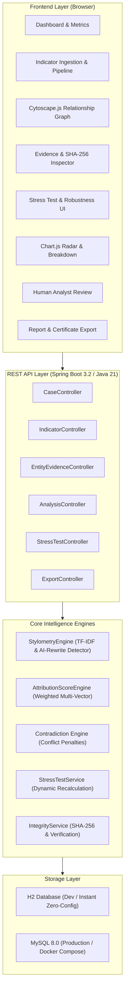

# DAVIS Architecture Specification

## Digital Attribution & Verification Intelligence System
**SIH 2026 | Problem Statement ID: SIH26151 | Team: JugaaduSloths (185528)**

---

## 1. System Overview

DAVIS is an investigative attribution platform engineered to assist forensic analysts in correlating cross-domain indicators across darknet forums, onion services, keyservers, and blockchain ledgers.

The architecture emphasizes:
* **Controlled & OPSEC-gated simulation**: No live unauthorized dark-web crawling; all demo entities and data are synthetic.
* **Multi-vector dynamic scoring**: Scores are computed deterministically from active evidence dimensions.
* **Explainability**: Every score delta is traced to specific supporting or contradictory evidence.
* **Dependency stress testing**: Evaluates if an attribution lead collapses when a single vector (e.g., PGP or Wallet) is removed.
* **Cryptographic auditability**: Strict SHA-256 evidence hashing and immutable audit logging aligned with the Bharatiya Sakshya Adhiniyam (BSA) 2023.

---

## 2. Component Diagram

---

## 3. Dynamic Scoring Model

$$ \text{Total Score} = \min\left(100, \max\left(0, \sum V_i - \sum C_j\right)\right) $$

Where:
* $V_i$ represents the 6 analytical dimensions:
  1. **Cryptographic Correlation ($V_{\text{crypto}}$)**: Max 25.0 pts (PGP signatures, keyserver verification)
  2. **Financial / Blockchain Correlation ($V_{\text{fin}}$)**: Max 20.0 pts (Wallet clustering, transaction telemetry)
  3. **Infrastructure Correlation ($V_{\text{infra}}$)**: Max 15.0 pts (Domain DNS, Tor onion hosting, SSL serial match)
  4. **Alias / Persona Correlation ($V_{\text{alias}}$)**: Max 15.0 pts (Normalized handles, registration records)
  5. **Stylometric Similarity ($V_{\text{sty}}$)**: Max 15.0 pts (Cosine TF-IDF match, modulated by 50% penalty if AI rewrite is detected)
  6. **Temporal & Behavioural Overlap ($V_{\text{temp}}$)**: Max 10.0 pts (Operating UTC activity windows)
* $C_j$ represents contradiction deductions:
  1. Conflicting concurrent sessions (clearnet vs darknet active at the same time): $-8.0$ to $-12.0$ pts
  2. Conflicting cryptographic subkey revocations (third-party signatures): $-6.0$ to $-10.0$ pts

---

## 4. AI-Rewrite Awareness Engine

To address adversarial evasion using Large Language Models (LLMs) to paraphrase extortion demands or messages:
* DAVIS extracts vocabulary richness (Type-Token Ratio), sentence length variance, and formal syntactic transition phrases.
* If a text sample exhibits flat variance and formal LLM transitions ("kindly be advised", "strictly required", "comprehensive disclosure"), it is flagged with `aiRewriteDetected = true`.
* The stylometric contribution is automatically downweighted by 50% to prevent synthetic obfuscation artifacts from misleading investigators.
